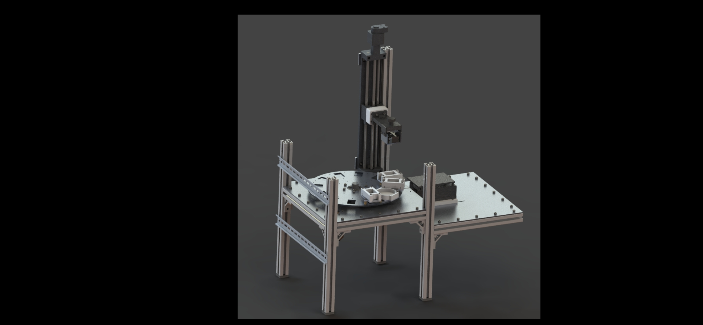

# Undergraduate Researcher  
**Additive Manufacturing and Metamaterials Lab (AMML)**  
**UC Berkeley** | *May 2023 – December 2024*

---

## Overview  
As an undergraduate researcher, I focused on advancing **multimaterial Digital Light Processing (DLP) 3D printing** and the development of **piezoelectric actuators**. My work involved designing 3D printers and their software, manufacturing small scale piezoelectric actuators, and optimizing printing parameters of novel printing techniques.

---

## Key Contributions  

### Multimaterial DLP Printing
I designed and fabicated a DLP printer that incorporated a new cleaning method between resin swaps. I also configured the software for material swapping and cleaning through **Arduino** and **LabVIEW**. Produced successful multimaterial prints with minimized resin cross-contamination. 

**Example Prints:**  

  
  

**In-situ Electroless Plating:** Contributed to a project incorporating automated electroless plating techniques, though it was not completed before my graduation. The printer I designed encorporated a 3D printed rotary stage for cycling between vats.

**SolidWorks Model of the Rotary 3D Printer**

  

### P$\mu$SL Lattices
I enhanced the performance of our [Projection micro-stereolithography](https://pubs.aip.org/aip/rsi/article-abstract/83/12/125001/357459/Design-and-optimization-of-a-light-emitting-diode?redirectedFrom=fulltext) (P$/mu$SL) 3D printer, which prints microlattices with a resolution of 1.3 $\mu$m/pixel. Oxygen inhibition of photopolymerization was a substantial issue in printing performance. I was tasked with mapping the oxygen levels across the print area, and optimizing to reduce the $O_2$ gradient across it. The new vat design decreased the variation of oxygen concentration by 2x by improving the flow of $N_2$, allowing for repeatable printing conditions. An oxygen sensor was also implemented in LabVIEW for in-situ monitoring.

  

I developed a **MATLAB** script to detect and adjust slicing outliers, ensuring consistent strut thickness of ~35$\mu$m in printed microlattices. 

  

### Piezoelectric Actuator
I also designed piezoelectric bimorphs for actuating. The final model was a 2-axis bimorph structure that resulted in 100 microns of displacement in a 3x3x1cm package. To increase the amplitude, another stage of amplification was designed and simulated in **Solidworks**, as shown below. I fabricated printed piezoelectric composites in several lattice configurations made for high density actuator systems.

  <video style="height: 600px; width: auto;" controls autoplay loop muted>
    <source src="assets/amplifier.mp4" type="video/mp4">
    Your browser does not support the video tag.
  </video>

---

## Skills & Tools  
- **Software Proficiency:** MATLAB, LabVIEW, SolidWorks, Arduino, Python.  
- **Lab Equipment:** Tensile testing machines, centrifuges, 3D printers, ovens, and precision measurement tools.  
- **Materials Expertise:** Worked with hazardous materials, ensuring safety and compliance.  

---