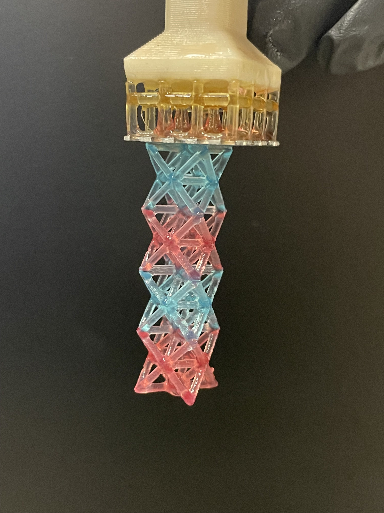
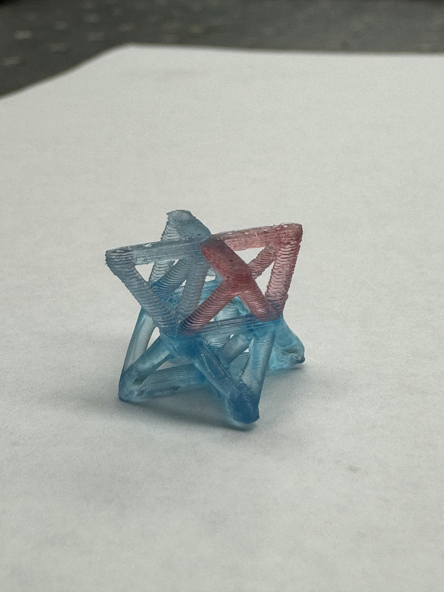
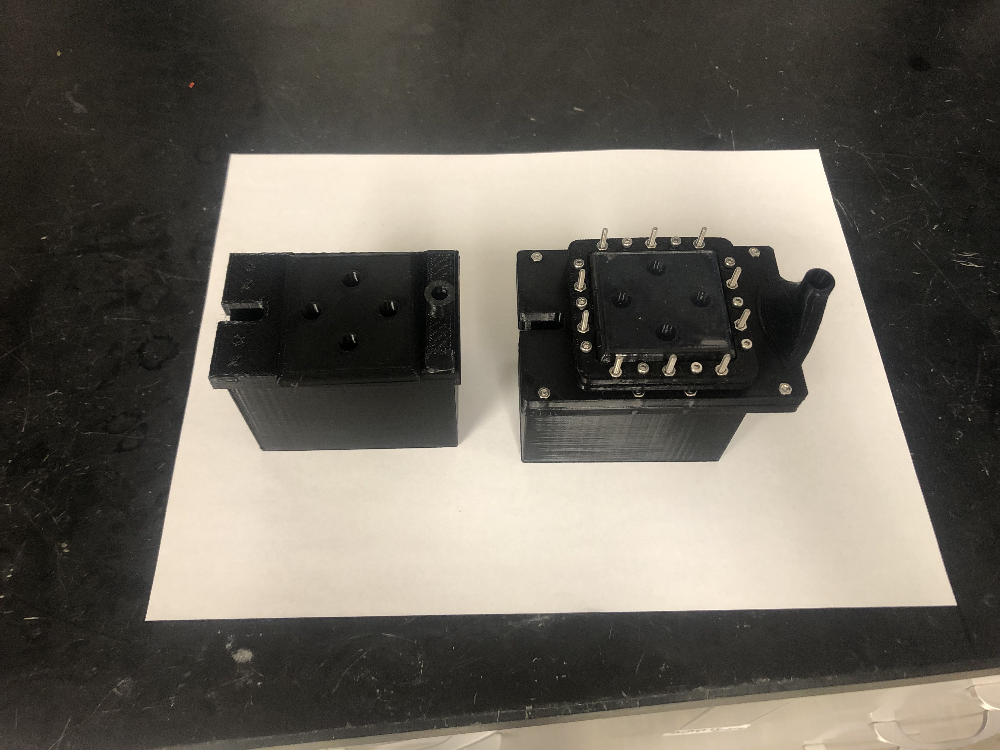
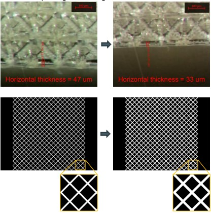

## Job Specifics
Between May 2023 and December 2024, I worked as an undergraduate researcher at the Additive Manufacturing and Metamaterials Lab (AMML) at UC Berkeley. My primary focus was on multimaterial Digital Light Processing (DLP) 3D printing and printable piezoelectric actuators. I designed and worked on numerous printers with novel printing techniques.

## What I worked on

### Multimaterial DLP Printing
I designed and assisted in the fabrication of a DLP printer that incorporated a novel cleaning method between resin swaps. I also configured the software for material swapping and cleaning through **Arduino** and **LabVIEW**. Our first prints were successful, showing multimaterial capabilities while minimizing contamination between resins. Some images of prints are shown below:

  
  

I also worked on in-situ electroless plating, but I graduated before the project was finished.

### P$\mu$SL Lattices
I worked on refining the printing of our [Projection micro-stereolithography (P$/mu$SL) 3D printer](https://pubs.aip.org/aip/rsi/article-abstract/83/12/125001/357459/Design-and-optimization-of-a-light-emitting-diode?redirectedFrom=fulltext), which prints microlattices with a resolution of 1.3 $\mu$m/pixel. Oxygen inhibition of photopolymerization was a substantial issue in printing performance. I was tasked with mapping the oxygen levels across the print area, and optimizing to reduce the O_2 gradient across it. My updated vat design decreased the variation of oxygen concentration by 2x by improving the flow of N_2, allowing for repeatable printing conditions. An oxygen sensor was also implemented in LabVIEW for in-situ monitoring.

  

Because the projection size is so small, the lattices were delaminating from the model. This was because the slicing of the 3D model resulted in small feature sizes. I generated a **MATLAB** script to find the slicing outliers and regenerate them with suitable parameters. This resulted in constant strut thickness of ~35$\mu$m in the final model.

  

### Piezoelectric Actuator

<video width="640" height="360" controls autoplay loop muted>
  <source src="assets/amplifier.mp4" type="video/mp4">
  Your browser does not support the video tag.
</video>
