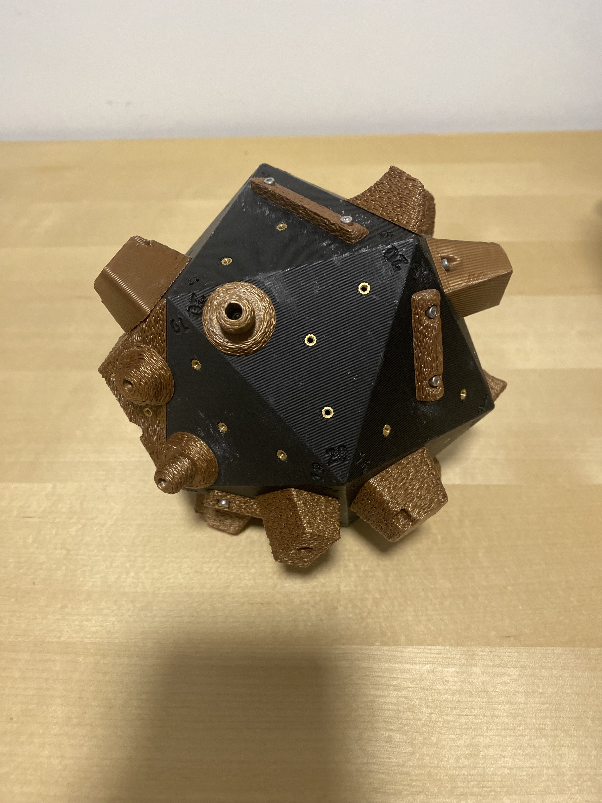
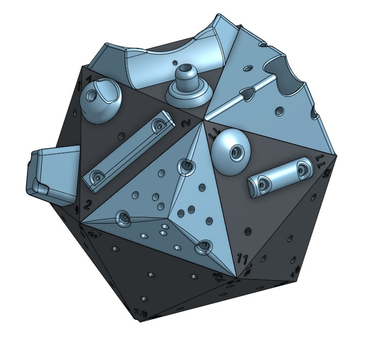

# Boulder Ball
**UC Berkeley** | *April 2023*

  
  

I designed an icosahedron (20 sided polygon) that has interchangeable holds to make up climbing routes.

The model was designed in **Onshape**, as I wanted to explore alternative CAD software. The icosahedron serves as the base, with threaded inserts embedded into its sides to securely attach modular climbing holds. I created over ten unique hold designs, each offering varying textures and challenges.

---

## Additions and Improvements:
During prototyping, I noticed the need for clear identification of the faces. To fix it, I added indented numbering to each side. I integrated a recessed allen key holder secured by a magnet to allow for modification of routes on the go.

The slicing parameters were optimized to balance impact resistance and lightweight construction. The design is robust enough to withstand falls yet light enough to be easily carried in one hand. The holds were altered to have a textured outer surface. This makes the holds easier to grip with sweaty hands.

** Video of my modified Voron 2.4 3D printer printing out holds at quality speeds**

  <video style="height: 600px; width: auto;" controls autoplay loop muted>
    <source src="assets/printing_boulder_ball.mp4" type="video/mp4">
    Your browser does not support the video tag.
  </video>

I have made the Boulder Ball as a gift for several of my friends, and they have been used for many hours without breaking.

---

## Skills Applied:
- Onshape
- 3D Printing
- Product Design
