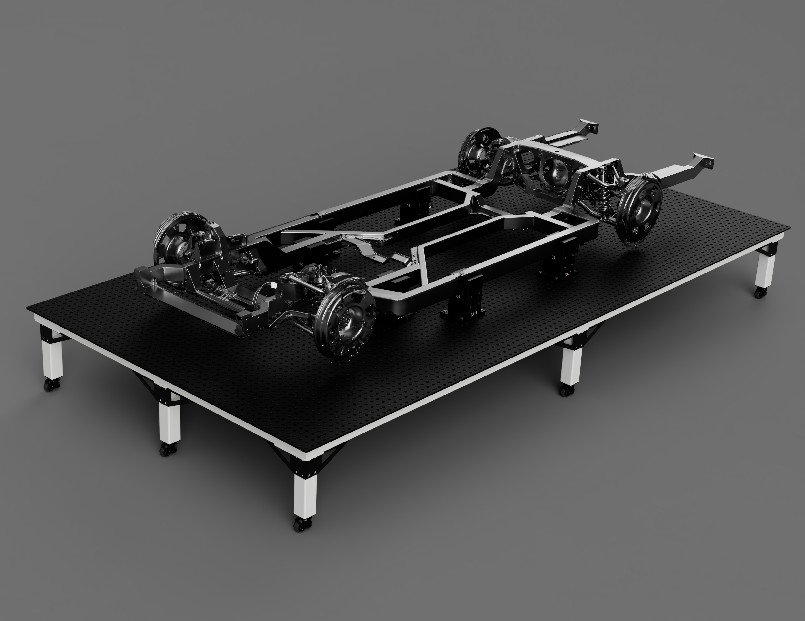
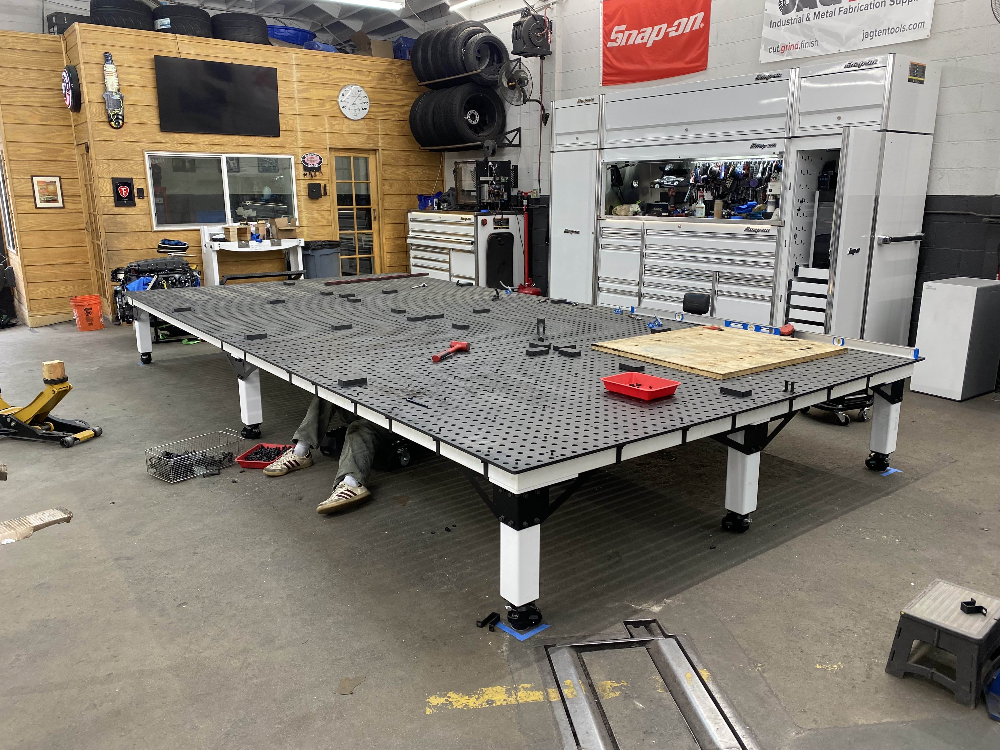
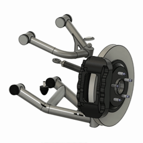
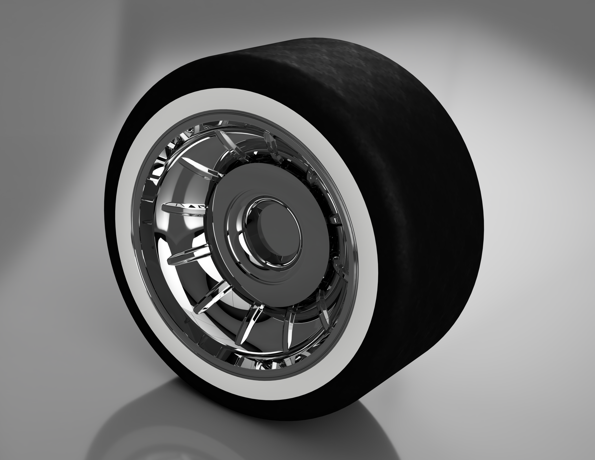
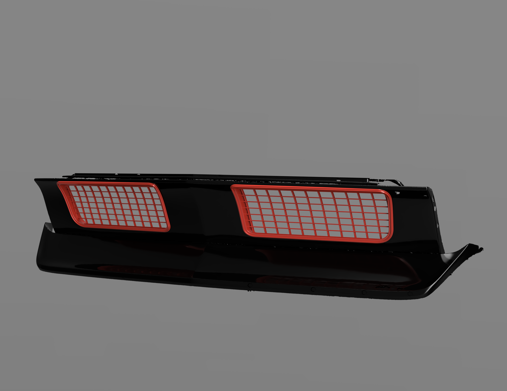

# Lead Mechanical Engineer 
**Fierro Fab**  
**Long Beach, CA** | *Mar 2025 – Present*

---

## Overview  

At Fierro Fab, I bridge the gap between the engineering and the fabrication of resto-mod cars (Old cars that are being restored but have modern modifications). As the lead mechanical engineer, my role is very interdisciplinary. I coordinate projects from start to finish, consisting of conceptualization, design, electronics, and fabrication.

## Key Contributions 

### Fixture Table

One of the larger projects I have worked on was designing a fixture table for our primary car, a 1965 Lincoln Continental Convertible. The table was designed in Autodesk Fusion using a mix of square tubing and laser-cut plates. I orchestrated the orders for all components, designed tooling to ensure the table stays square, and assisted in its assembly. Using 3D scans of the chassis, I designed custom mounting fixtures that lock the car body to the table at a precise location. With the addition of a scanning tracker field, we can scan portions of the car and align them to the global coordinate system. This allows us to work on the car in sections, reducing the complexity of large files.

  
  

### Wheels, Tubs, and Suspension Geometry

For a car making over 1000 horsepower, the wheels and tires are critical. We're designing our own wheels that are much larger than stock so that the car has a larger contact patch with the ground to transmit torque.

In order for these wheels to fit, I reverse-engineered the existing suspension geometry from scans. This allows me to simulate the suspension travel and find any collisions before we begin modifying panels. This visualization also allows us to show our customers the car at varying ride heights.

  
  

### Concealed Gas Filler

I am also  redesigning the taillight to incorporate a concealed fuel-filler compartment. This involves developing a mechanism that allows the taillight to pivot, providing access to the fuel cap. Currently, the taillight has been remodeled, and prototypes of the lifting mechanism have been mocked up. The electronics are temporarily set up through Arduino, connecting two LEDs with a hall effect sensor and a button.

**CAD Model of the Tail Light**

  

### Additional Projects

**Custom Grill for a 1968 Camaro**

  
  

