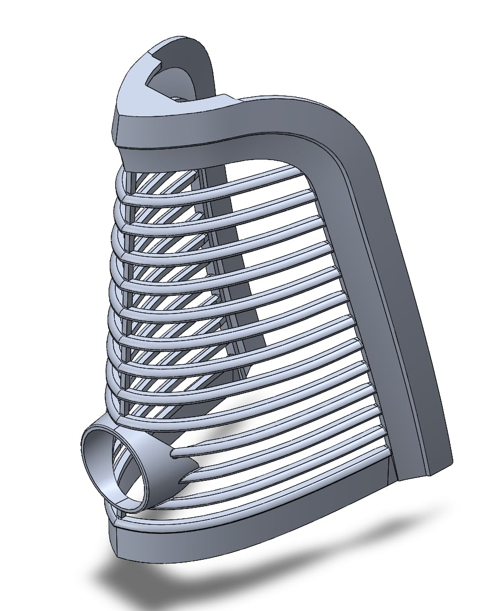

# Mechanical Engineer 
**Fierro Fab**  
**Long Beach, CA** | *Mar 2025 – Present*

---

## Overview  
At Fierro Fab, my primary role is to utilize 3D scanning to aid in the restoration of classic 1960s Lincoln automobiles. This process includes setting up parts for scanning, repairing and cleaning mesh data, and converting scans into CAD models for fabrication and modification.

In addition to scanning and modeling, I am redesigning the tail lights to incorporate a concealed fuel-filler compartment. This involves developing a mechanism that allows the tail light to pivot, providing access to the fuel cap. Currently, the tail light has been remodeled, and prototypes of the lifting mechanism are in development.

**SolidWorks Model of the Rotary 3D Printer**

  

Beyond digital reconstruction, I actively contribute to the restoration of internal panels by sandblasting components, removing spot welds, and welding to repair damaged sections. I also assist in machinery maintenance, wiring, and design improvements to support the overall restoration process.