

# Mechanical Engineer
**Fierro Fab**  
**Long Beach, CA** | *Mar 2025 – Present*

---

## Overview  

As a Mechanical Engineer at Fierro Fab, I take high-end resto-mod builds — classic cars rebuilt with modern drivetrains, electronics, and hardware — from concept to finished part. My work spans 3D scanning and metrology, fixture and mechanism design, electronics integration, and hands-on fabrication, bridging the engineering side and the shop floor so that what gets designed is what actually gets built.

## Key Contributions

### Fixture Table

One of the larger projects I have worked on was designing a fixture table for our primary car, a 1965 Lincoln Continental Convertible. The table was designed in Autodesk Fusion using a mix of square tubing and laser-cut plates. I orchestrated the orders for all components, designed tooling to keep the table square, and assisted in its assembly. Using 3D scans of the chassis, I designed custom mounting fixtures that lock the car body to the table at a precise location. With the addition of a scanning tracker field, we can scan portions of the car and align them to the global coordinate system, letting us work on the car in sections and reduce the complexity of large files.

  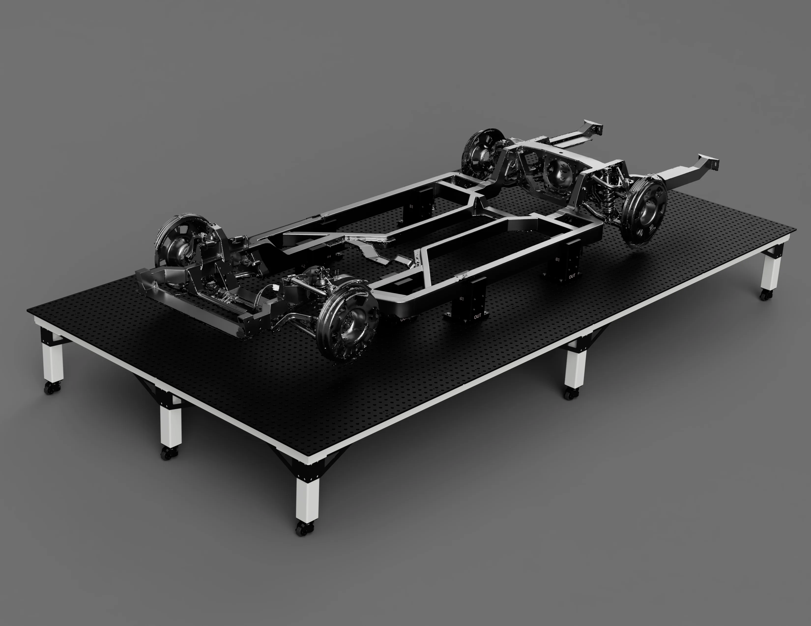
  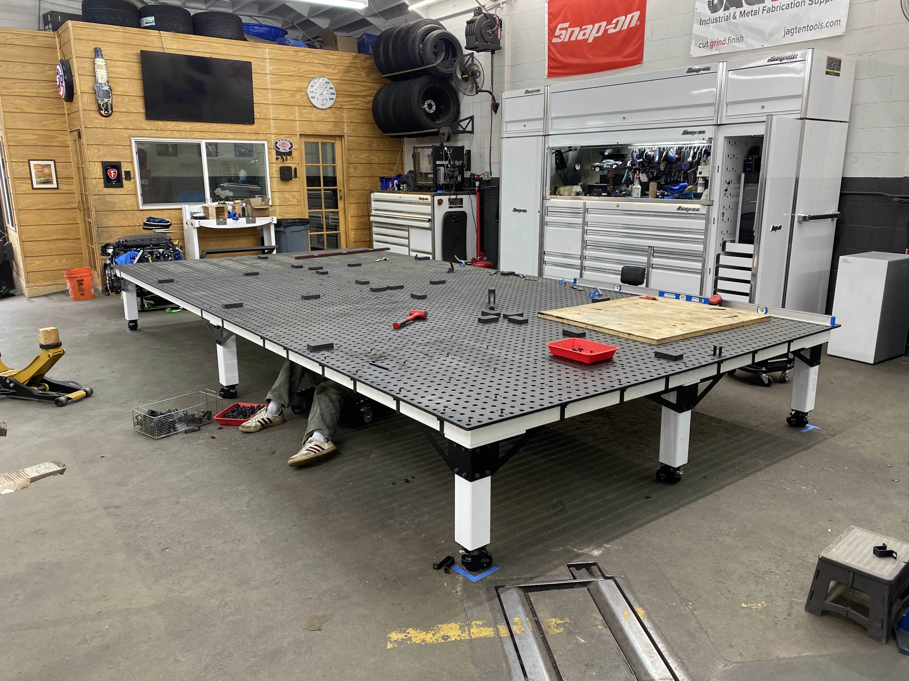

After welding, I 3D-scanned the assembled table with the chassis in place and compared it against the CAD to map flatness deviation. Most of the surface came in within 2 mm (1/16 in) across the full 9 × 18 ft span, with the largest error isolated to the bottom-right corner (shown in orange). Leveling is still ongoing — it isn't fully dialed in yet, but it's well within what our current work requires. I also designed dedicated locating fixtures, like the rear chassis fixture below, that bolt to the table's hole grid and constrain the body at known points.

  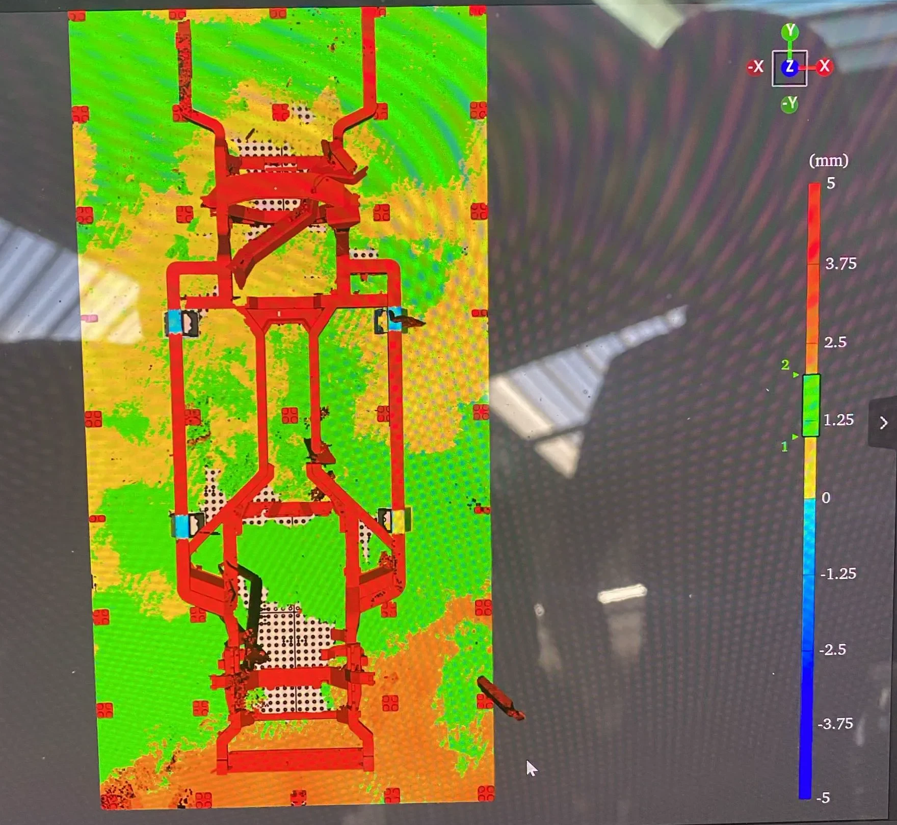
  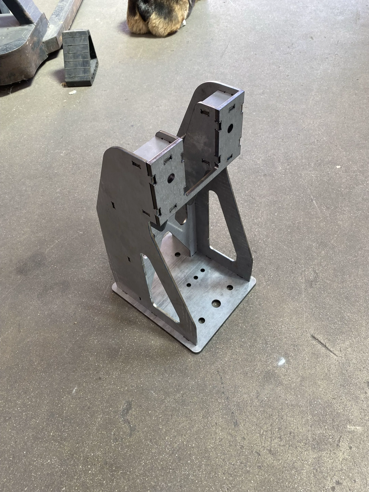

### Measurement Tower

To take repeatable reference measurements off the fixture table, I adapted a pre-owned cast magnesium tower by designing a machined linear-rail slider that gives it fine micro-adjustment along the table. Bolted to the table's grid, it provides a rigid, precisely positionable datum for measuring and aligning body sections.

  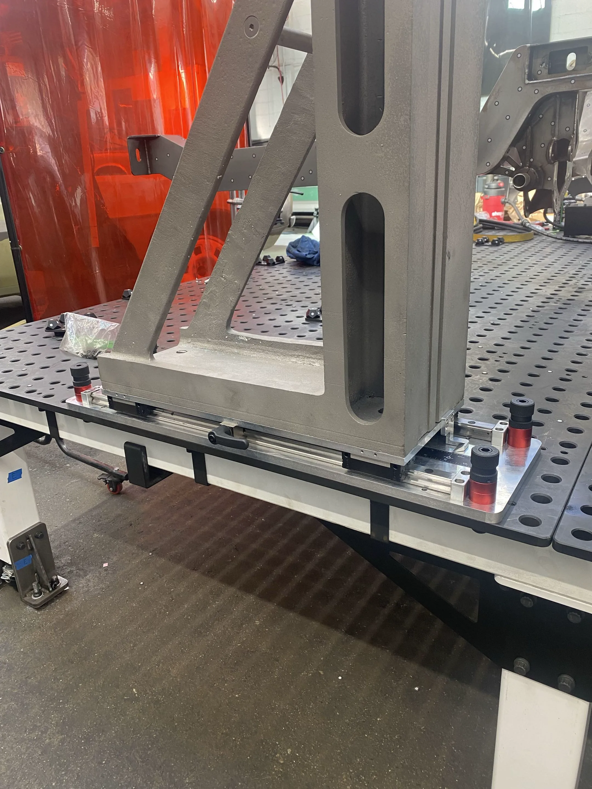
  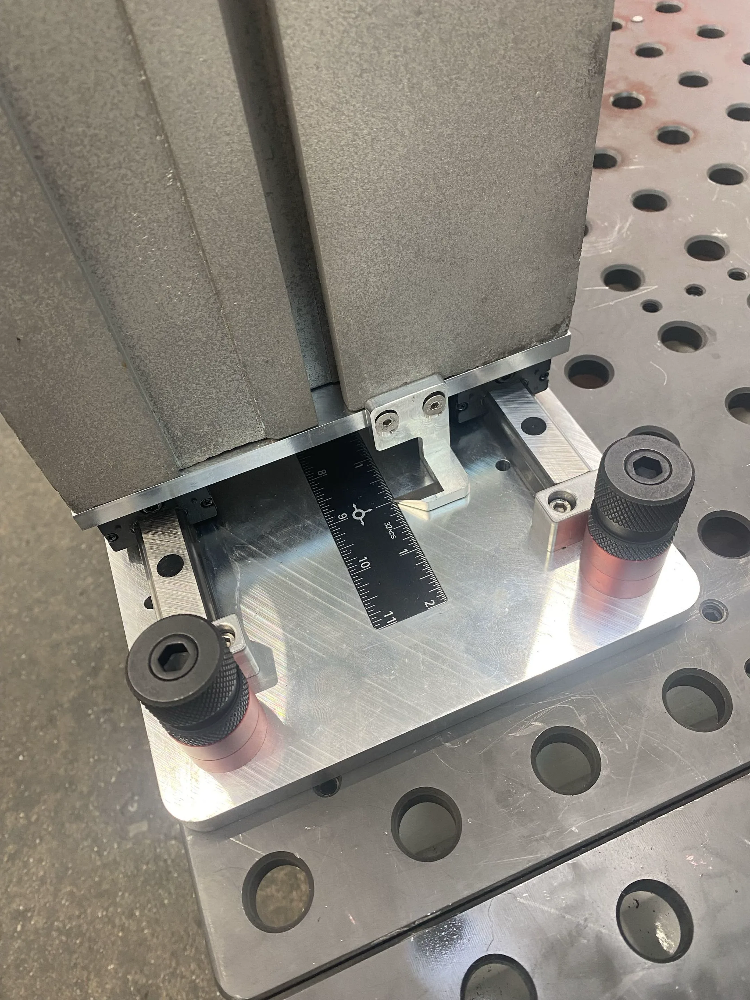

### Custom Door Handle

I redesigned the car's door handle, machining it from billet aluminum and replacing the original mechanical linkage with a digital one: the handle integrates a microswitch that triggers a soft-close latch rather than physically pulling it. To preserve the factory look, I 3D-scanned the door panel's surface and matched the handle's profile to the scan, so the result reads as nearly identical to the original — just with noticeably less slop in the button.

I also extended the handle by 1/4 inch. The door panels have a scooped hand indent that varies from panel to panel; the added length keeps the handle from crossing into that dish, making the fit look intentional across the variance.

  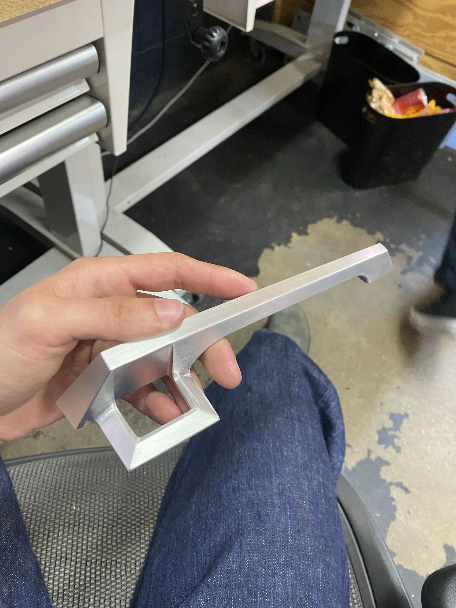
  <video style="height: 300px; width: auto;" controls autoplay loop muted><source src="assets/fierro-fab/door-handle-demo.mp4" type="video/mp4">Your browser does not support the video tag.</video>

### Wheels, Tubs, and Suspension Geometry

For a car making over 1000 horsepower, the wheels and tires are critical. We're designing our own wheels that are much larger than stock so the car has a larger contact patch with the ground to transmit torque.

In order for these wheels to fit, I reverse-engineered the existing suspension geometry from scans. This lets me simulate the suspension travel and find collisions before we begin modifying panels, and it lets us show customers the car at varying ride heights.

  <video style="height: 300px; width: auto;" controls autoplay loop muted><source src="assets/fierro-fab/suspension-travel.mp4" type="video/mp4">Your browser does not support the video tag.</video>
  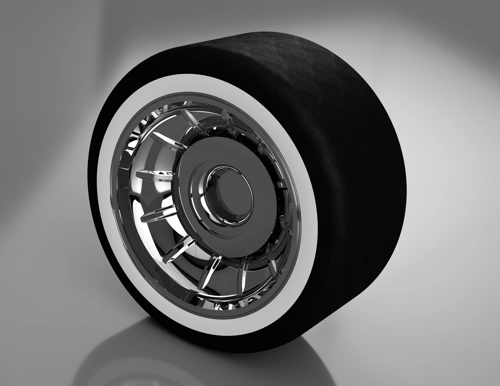

### Concealed Gas Filler

I am also redesigning the taillight to incorporate a concealed fuel-filler compartment, with a mechanism that lets the taillight pivot to provide access to the fuel cap. So far the taillight has been remodeled and prototypes of the lifting mechanism have been mocked up. The electronics are temporarily set up through Arduino, connecting two LEDs with a hall-effect sensor and a button.

  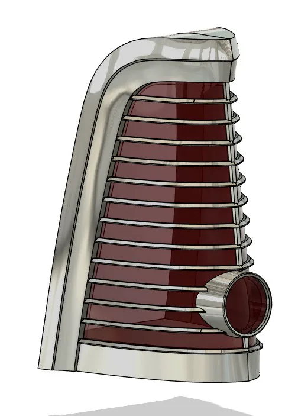

### Custom Grill (1968 Camaro)

I designed a custom grill for a 1968 Camaro, taking it from CAD through to the finished part installed on the car.

  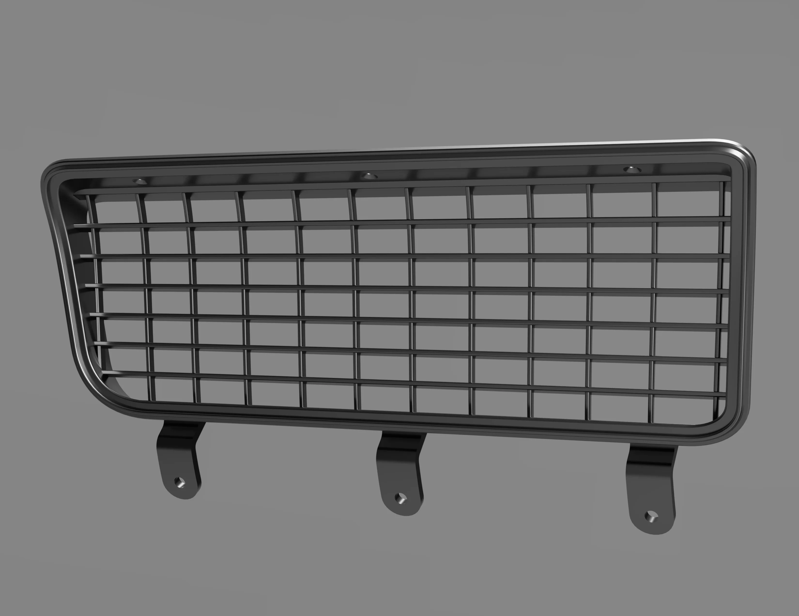
  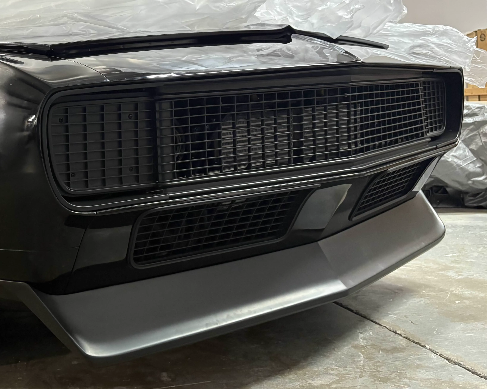

### Reverse Light

A backup (reverse) light that mounts to the rear bumper and illuminates when the car is in reverse. I prototyped the housing and lens fit by 3D-printing the bezel around a clear lens.

  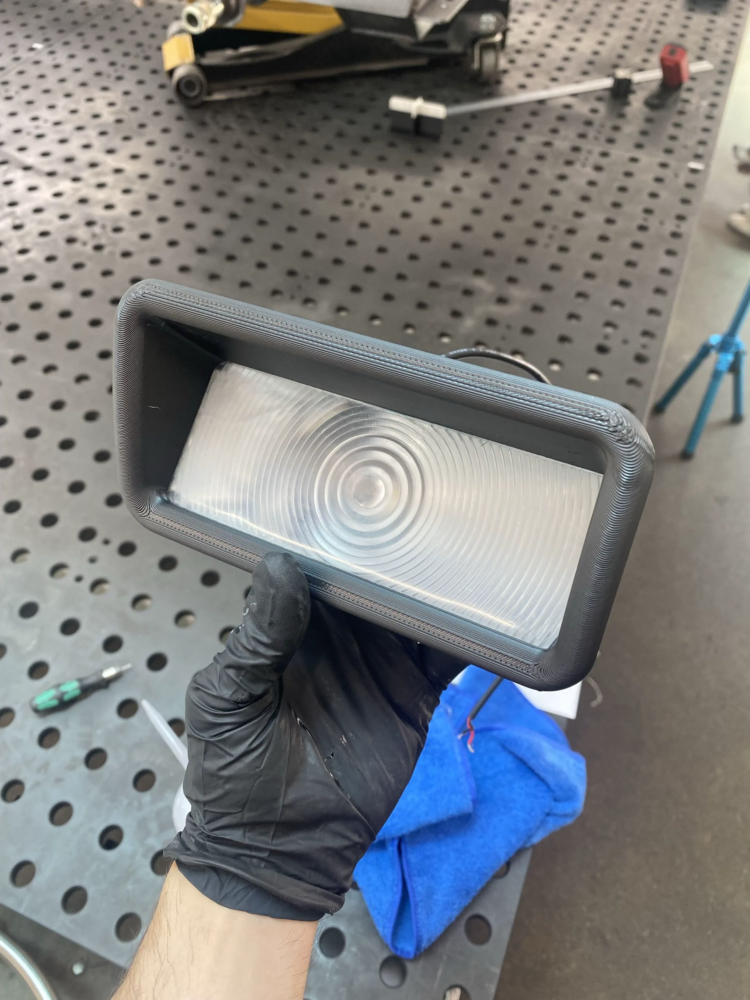

