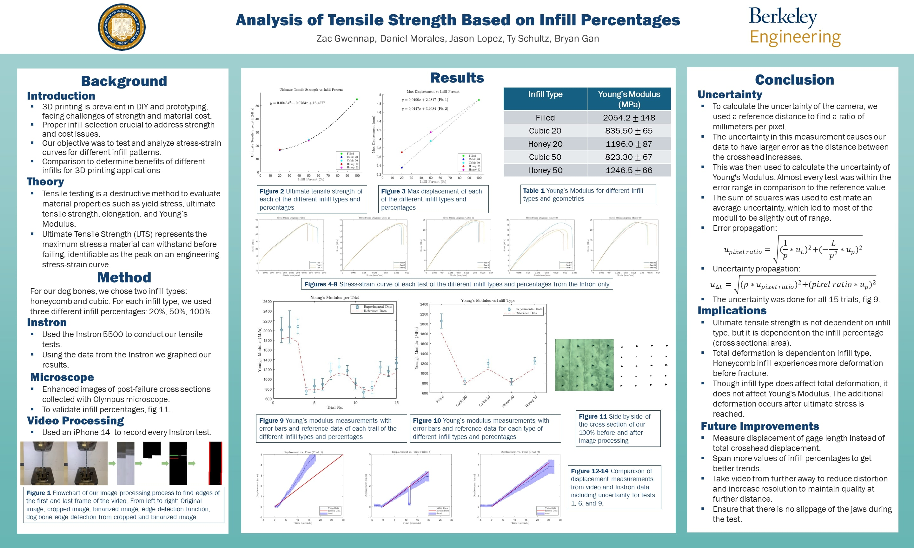
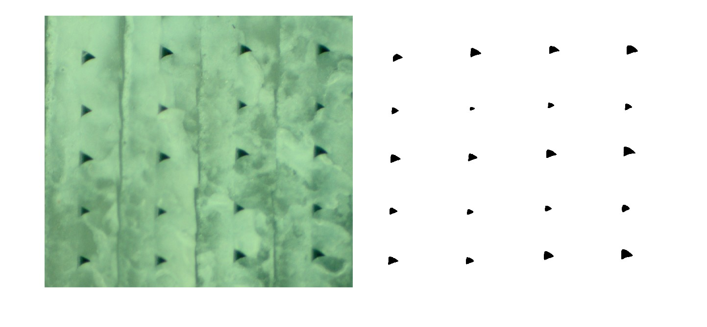
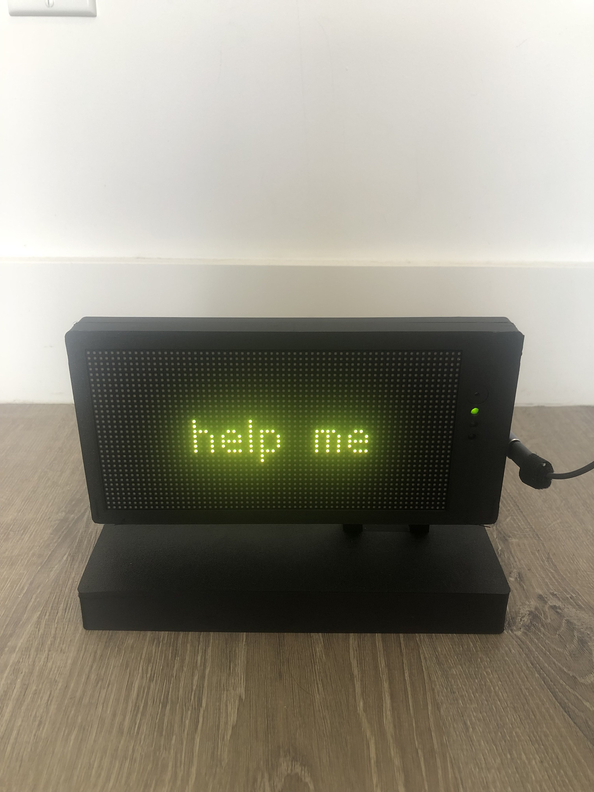
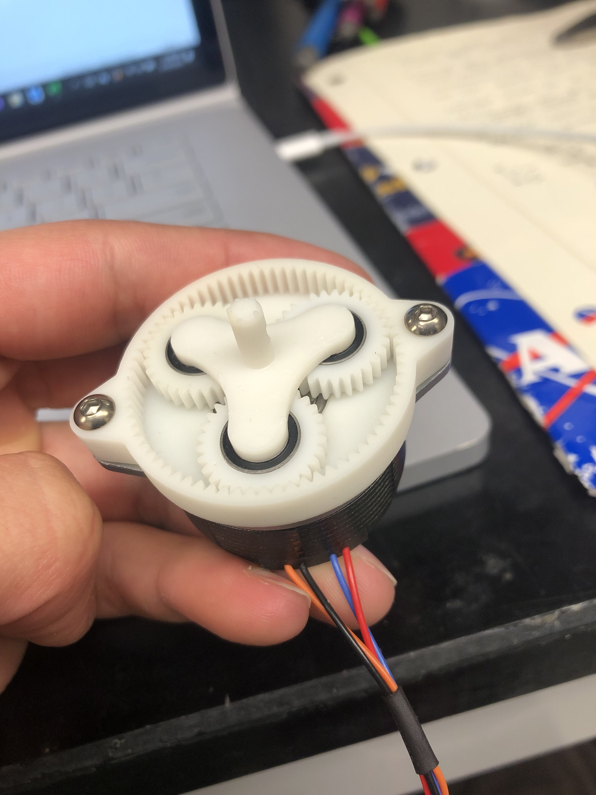
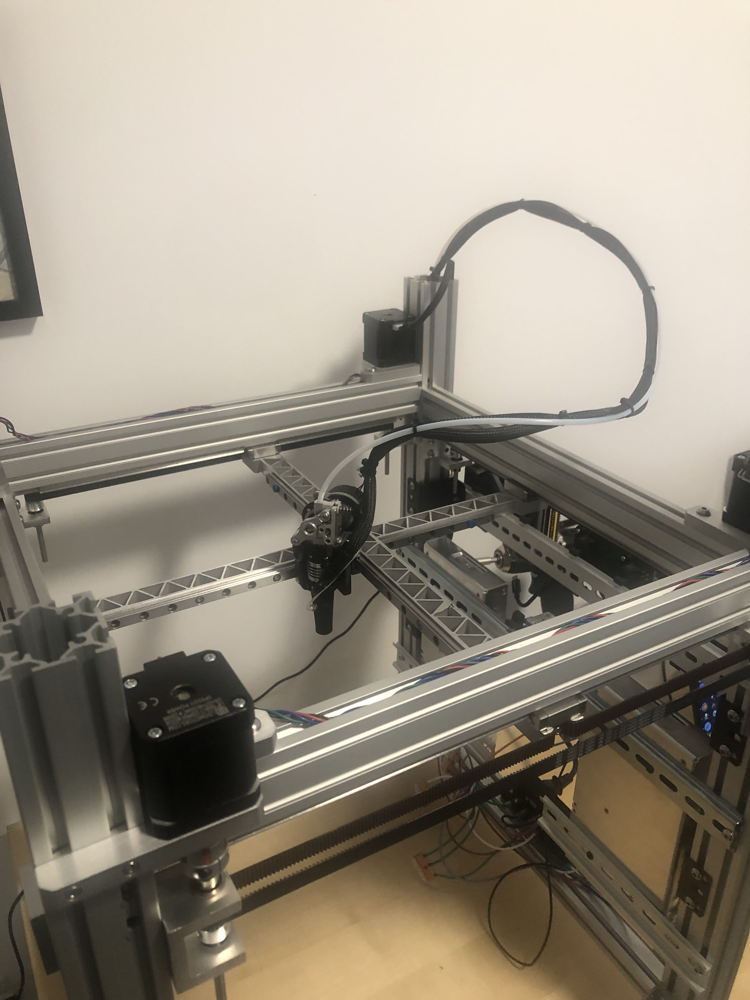

# Miscellaneous Projects

---

## Tensile Testing of 3D printed Infill Patterns
In my group project for Experimentation and Measurements, we explored the tensile properties of 3D-printed infill patterns, earning second place in the class. I led the data analysis, using MATLAB to perform all mathematical calculations and video processing. This included comparing strain data from an Instron tensile testing machine with displacement measurements derived through video processing.

  

Microscope images of the cross sections also yielded information of the actual part density of around 99%

  

---

## IoT LED Matrix
In one of my classes, I created a LED matrix that rotates on a bistable latch, and displays the time and weather based on current location.

  

    
  

  

    <video style="height: 400px; width: auto;" controls autoplay loop muted>
      <source src="assets/bistable_latch.mp4" type="video/mp4">
      Your browser does not support the video tag.
    </video>
  

---

## Small Form Factor Planetary Gearbox
For a extruder prototype, I designed and SLA printed a 10:1 planetary gearbox. Due to other reasons, this idea was scrapped.

  

---

## Old attempts at Custom 3D Printer
A while back, I had some designs for a 3D printer. I wasn't fully satisfied with the design, so I eventually scrapped the project and repurposed the materials.

  

---

## Compact and Lightweight Climbing Brush
Long climbing brushes are usually expensive or heavy. I designed and 3D printed my own for around $10. It has been used on dozens of trips and works flawlessly. It utilizes tarp poles that can collapse, and a 3D printed mount for a brush.

  

---

