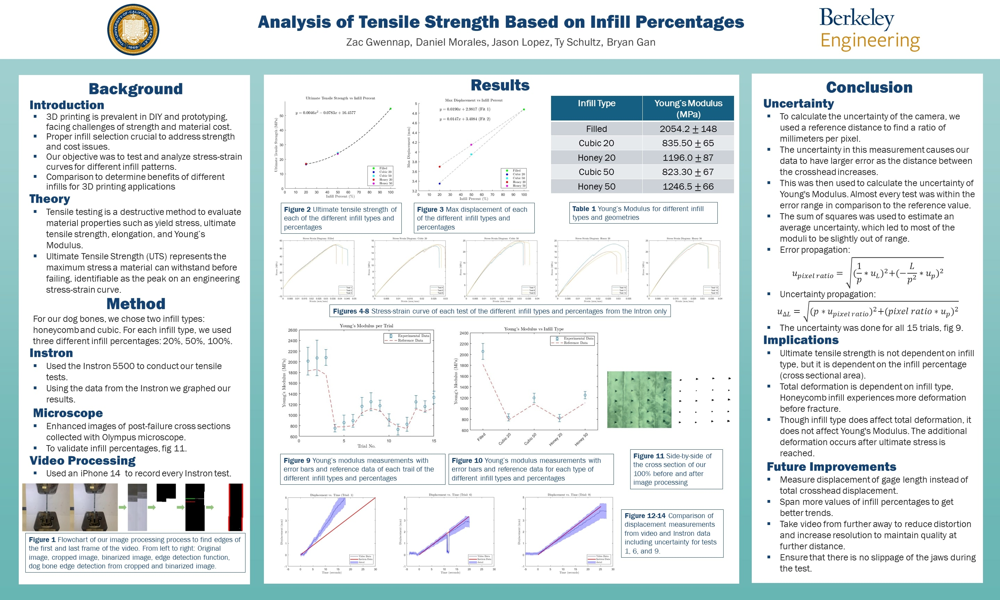
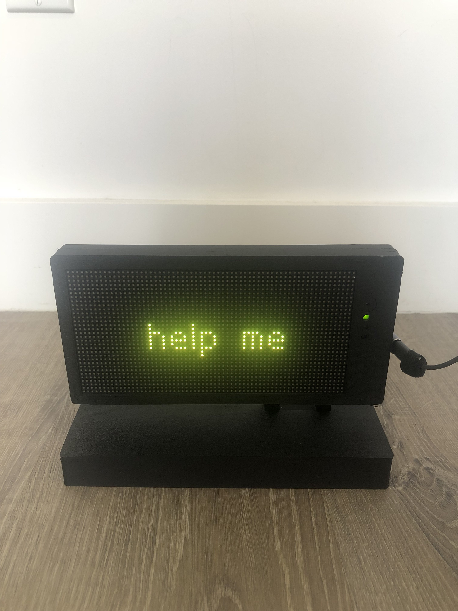

# Miscellaneous Projects

---

## Tensile Testing of 3D Printed Infill Patterns

As a group project for Experimentation and Measurements, we investigated the tensile properties of different FDM infill geometries, earning second place in the class competition. I led the data analysis pipeline, using **MATLAB** to perform all mathematical calculations and to process video footage for displacement tracking. Strain data from an Instron tensile testing machine was cross-validated against displacement measurements extracted from video, providing an independent verification of the mechanical results.

  

Microscope cross-sections of the printed specimens confirmed an actual part density of approximately 99%, validating the print parameters used in the study.



---

## IoT LED Matrix

For a class project, I designed and built an LED matrix display that shows the current time and local weather based on GPS location. The display is mounted to a bistable latch mechanism that allows it to rotate between a flat storage position and an upright display position without requiring a powered hold in either state.

  
  <video class="gallery-img" controls autoplay loop muted>
    <source src="assets/bistable_latch.mp4" type="video/mp4">
    Your browser does not support the video tag.
  </video>

---

## Small Form Factor Planetary Gearbox

To meet the torque and size requirements of an extruder prototype, a 10:1 planetary gearbox was designed and fabricated using SLA 3D printing. The compact geometry of a planetary arrangement was well-suited to the tight space envelope. The extruder concept was ultimately discontinued for unrelated reasons before the gearbox was put into use.



---

## Early 3D Printer Designs

Prior to MoXY, several concept designs for a custom 3D printer were developed and ultimately set aside. While none progressed to full builds, the design work informed later decisions made during MoXY development. The hardware was repurposed rather than discarded.



---

## Compact Climbing Brush

Commercial climbing brushes designed for outdoor use tend to be expensive, heavy, or both. This brush was designed to address both constraints: collapsible tarp poles serve as the handle, and a 3D printed mount attaches a standard brush head at the working end. Total material cost was approximately $10. The design has been used across dozens of climbing trips without failure.


