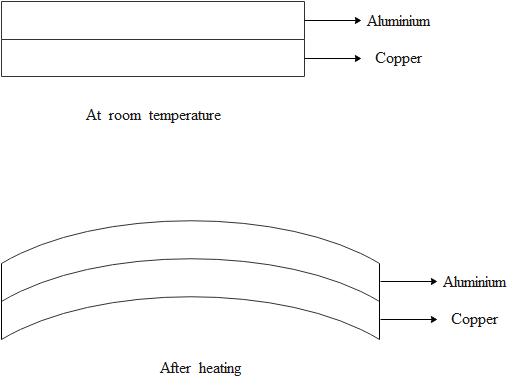
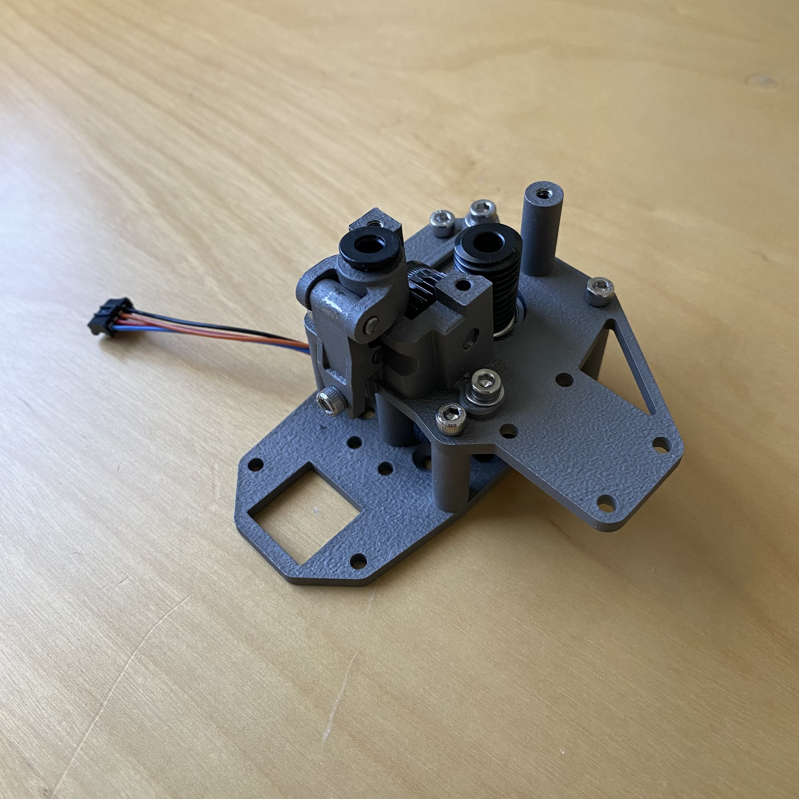
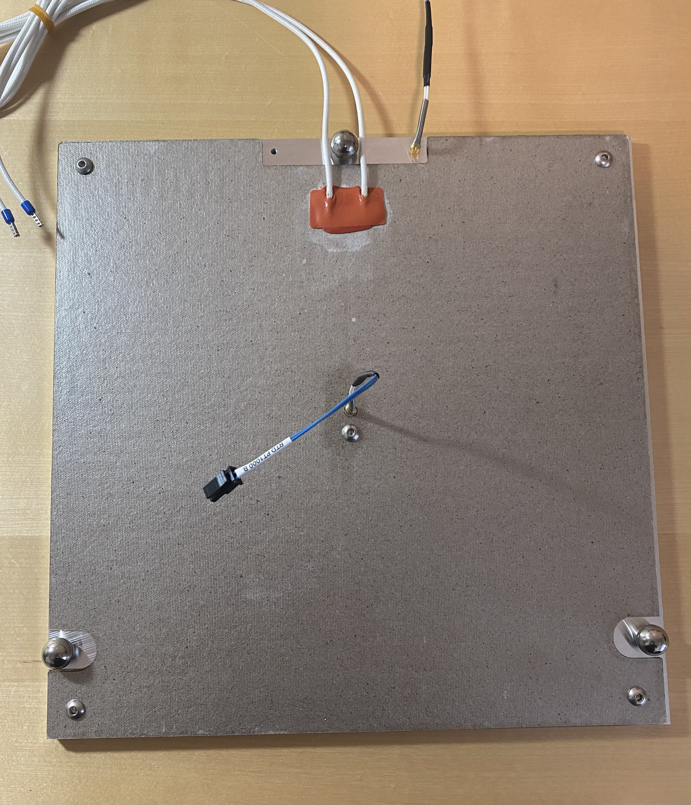

# MoXY 3D Printer

MoXY is a custom FDM Cross Gantry 3D printer fully designed by me. 

  

During my first semester at Berkeley, one of my professors stated that 3D printing should not be used for concept design because it was too slow. I always wanted to change that narrative and got heavily invested in 3D printer design.

Summer 2024 is when I began development of MoXY, a FDM 3D printer capable of high speeds and the ability to print exotic materials (120+&deg;C). It utilizes an all steel frame to minimize the effect of [bimetallic expansion](https://en.wikipedia.org/wiki/Bimetallic_strip), contrary to other printers that use steel rails on an aluminum beam. 

  

## Motion System

This design consists of 8 stepper motors controlling XY movement to increase torque and reduce belt length. By reducing the belt length, it increases the frequency of vibrations that occur during high accelerations. Increasing the frequency minimizes the effect on print quality. 

Important consideration was taken for bearing and shaft design, since the tension of belts is very high. Needle bearings are used to distribute the load, and shaft deflection calculations were shown to be well within the limits of shaft geometry.

Using Mersennes Law:

$$
\delta_{max} = \frac{Fb \left( L^2 - b^2 \right)^{3/2}}{9 \sqrt{3} L E I}
$$

Shaft deflection was determined to be within material properties.

The XY motion system relies on linear rails for alignment. Similar to the [Pantheon HS3](https://www.pantheondesign.com/3d-printer), a monolithic ground steel plate is used to reach the tight parallelism constraints of linear rail movement systems.

  
  

## Custom Extruder

I created a new extruder design to fit the design constraints of my printer. It involves a 15:1 worm gear reduction and fully metal construction. The main parts wwere outsourced to a SLM metal manufacturer, and were printed in 316L stainless steel. The metal construction is necessary to radiate the excess heat generated through the extruder motor and hotend.

  

## Heated Bed Design

As the bed heats up, the thermal expansion of the bed will cause the bed to bend or bind up the linear rails. To compensate for this, a [Maxwell kinematic coupling](https://en.wikipedia.org/wiki/Kinematic_coupling) is used to precisely position the bed while allowing it to expand.

  

## Specs:
*Note: Some of the specs are expected, since the construction of the printer is still ongoing. The numbers for predicted specs are based on similar machines.*

- 300x300x250mm Build Chamber
- Heated Bed up to 120 &deg;C sustained
- Quality accelerations of 60,000 mm/s^2
- All metal worm gear extruder
- Flow rates up to 80 mm^3/s with 0.4mm nozzle

## Skills used during project:
- CAD model designed in **Solidworks**
- Manufacturing methods used:
    - **FDM 3D printing** for fits and prototypes
    - **Waterjet** + **Manual mill** used for flat parts
    - Outsourced **CNC** work with proper drawings and GD&T
    - Outsourced **SLM 3D printing** complex geometries
- Proficiency in **Linux** and integration of WiFi through Raspberry Pi
- Software written in **Python**, running Klipper
- **Soldering**, **crimping**, and **wiring** for electronics box

## Future Expansions:
- 120 &deg;C chamber (insulation and chamber heaters)

