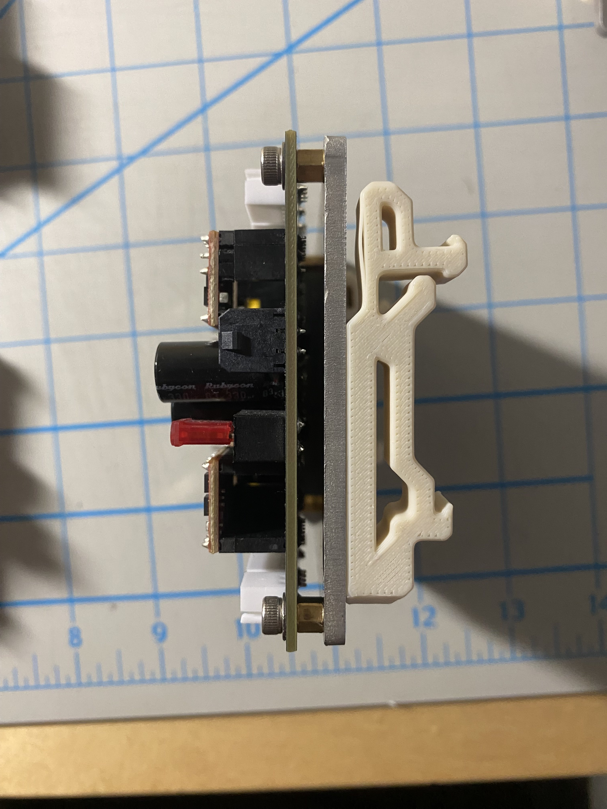

# MoXY 3D Printer

---

MoXY is a custom FDM Cross Gantry printer fully designed and developed by me.

**Custom Electronics Box**

  
  

---

## Inspiration and History

The inspiration for MoXY began during my first semester at UC Berkeley when a professor remarked that 3D printing was unsuitable for concept design due to its slow speed. Motivated to challenge this perspective, I embarked on creating a high-speed, high-performance 3D printer capable of handling exotic materials (120+°C). 

Development started in Summer 2024, with the goal of combining precision, speed, and material versatility. MoXY features an all-steel frame, designed to mitigate the effects of [bimetallic expansion](https://en.wikipedia.org/wiki/Bimetallic_strip), which are prevalent in designs that use steel rails on aluminum beams. 

  

---

## Motion System

New developments in stepper motor syncing allow for multiple stepper motors to be attached to the same belt. This concept is used in MoXY, with the X and Y axes running on 4 stepper motors each. This significantly increases torque while minimizing belt length. Shorter belts raise the frequency of vibrations caused by high accelerations, reducing their impact on print quality. 

Special care was taken in the design of bearings and shafts due to the high belt tension. **Needle bearings** were chosen for load distribution, and shaft deflection was carefully calculated using Mersenne's Law:  

$$
\delta_{max} = \frac{Fb \left( L^2 - b^2 \right)^{3/2}}{9 \sqrt{3} L E I}
$$

These calculations confirmed that the shaft deflection remains well within safe limits. Linear rails were employed for precise alignment, mounted on a monolithic ground steel plate to meet the stringent parallelism requirements of the motion system. This approach mirrors the design philosophy of high-end systems like the [Pantheon HS3](https://www.pantheondesign.com/3d-printer).

  
  

---

## Custom Extruder

I designed a custom extruder featuring a 15:1 worm gear reduction and a fully metal construction. The components were manufactured using **SLM 3D printing** in 316L stainless steel due to complex geometry. The metal body allows efficient dissipation of heat generated by the extruder motor and hotend, while the rigidity of steel allows for higher accelerations.

  

---

## Heated Bed Design

Thermal expansion of the heated bed posed a significant challenge. To address this, I implemented a [Maxwell kinematic coupling](https://en.wikipedia.org/wiki/Kinematic_coupling), which allows the bed to expand while maintaining its positioning. This design ensures the bed remains stable while accommodating thermal changes during printing.  

  

---

## Electronics
MoXY operates on a 24V supply for general components, while a 48V supply drives the high-torque stepper motors for the X and Y axes. The motion planning is handled by **Klipper** running on a Raspberry Pi, with WiFi connectivity for remote control. Several temperature probes ensure uniform chamber conditions, and custom software manages cooling fans, relays for the 110V heated bed and chamber, and the hotend. The electronics are housed in an electronics box with modular mounting and custom wiring.

**Custom Electronics Box**

  
  

**Image of mounting solution inside Electronics Box**

  

---

## Specs:
*Note: Some of the specs are expected, since the construction of the printer is still ongoing. The numbers for predicted specs are based on similar machines.*

- 300x300x250mm Build Chamber
- Heated Bed up to 120 &deg;C sustained
- Quality accelerations of 60,000 mm/s^2
- All metal worm gear extruder
- Flow rates up to 80 mm^3/s with 0.4mm nozzle

---

## Skills applied:
- CAD model designed in **Solidworks**
- Manufacturing methods used:
    - **FDM 3D printing** for fits and prototypes
    - **Waterjet** + **Manual mill** used for flat parts
    - Outsourced **CNC** work with proper drawings and GD&T
    - Outsourced **SLM 3D printing** complex geometries
- Proficiency in **Linux** and integration of WiFi through Raspberry Pi
- Software written in **Python**, running Klipper
- **Soldering**, **crimping**, and **wiring** for electronics box

---

## Future Developments:
- 120 &deg;C chamber (insulation and chamber heaters)
