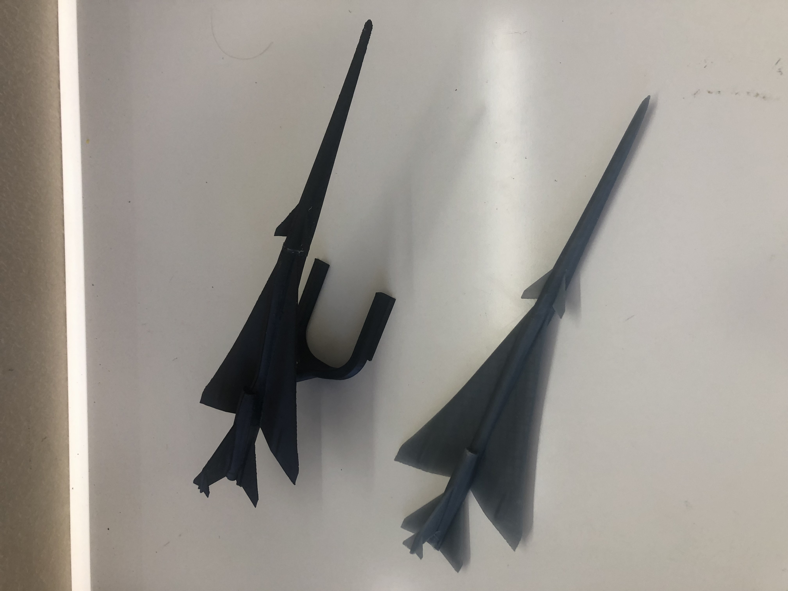
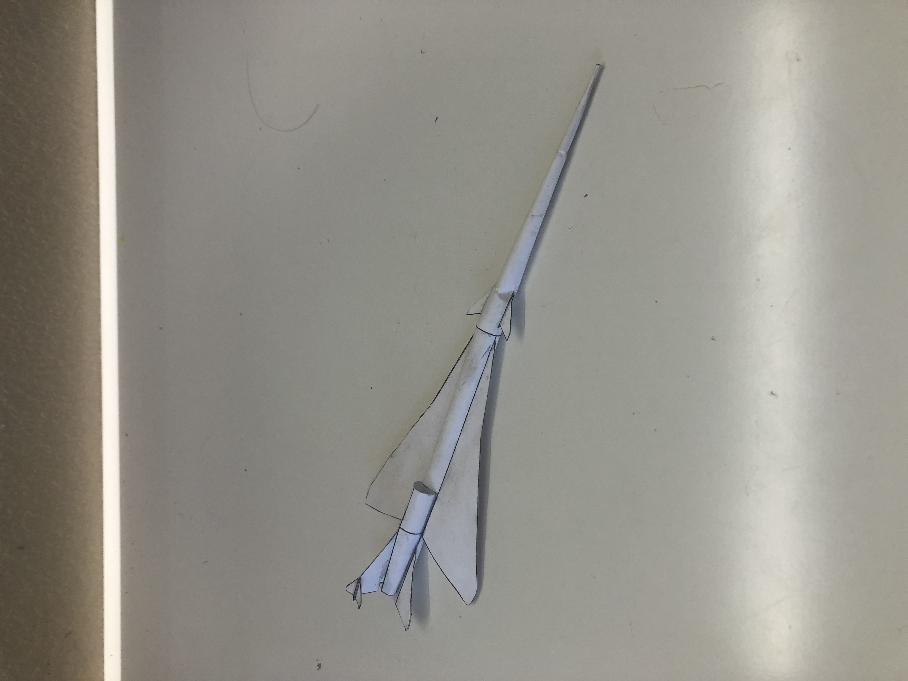

# NASA Intern + Volunteering 
**NASA Headquarters and Johnson Space Center**  
**Virtual** | *June 2021 – August 2021*

---

## Key Contributions
During my internship at NASA Headquarters, I worked on enhancing the CAD model of the X-59 aircraft to be suitable for 3D printing. My primary challenge was to thicken thin regions of the model that were problematic for 3D printing, all while ensuring that these modifications preserved the aircraft's original design aesthetics. I utilized **surface-based modeling** techniques in **SolidWorks** to meet these requirements. I then 3D printed prototypes, incorporating feedback from the NASA model shop to refine the designs. More info on the design can be found on [my page of the NASA website](https://www.nasa.gov/stem-content/x-59-3d-printing/).

**3D Printed Models of the X-59 Aircraft**

  

In addition to 3D printing, I designed a paper model of the X-59 aircraft that could be used in STEM education to inspire students and provide a hands-on learning experience. This project emphasized the importance of bridging engineering and education to make aerospace concepts accessible to younger audiences.

**Paper Model of the X-59 Aircraft**

  

## NASA Volunteering  
On top of my internship responsibilities, I volunteered to take on an additional engineering project with NASA’s Johnson Space Center.

As a volunteer, I contributed to the development of a retrieval system for incapacitated astronauts in lunar missions. My main task was to design a prototype vehicle in **SolidWorks** that could safely transport an incapacitated astronaut back to a lunar base. This involved conducting extensive research on previous lunar missions to understand the challenges posed by the lunar surface, such as terrain obstacles and design constraints.  

To optimize the retrieval system, I developed a **Python script** to calculate the energy expenditure required to transport an astronaut based on key parameters, including weight, terrain type, and vehicle efficiency. These calculations informed my design choices, ensuring the prototype could effectively operate under real-world lunar conditions.  

This project showcased my ability to integrate mechanical design, research, and computational tools to solve complex engineering challenges in space exploration.

