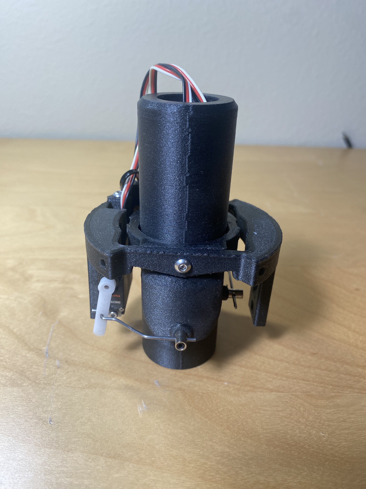
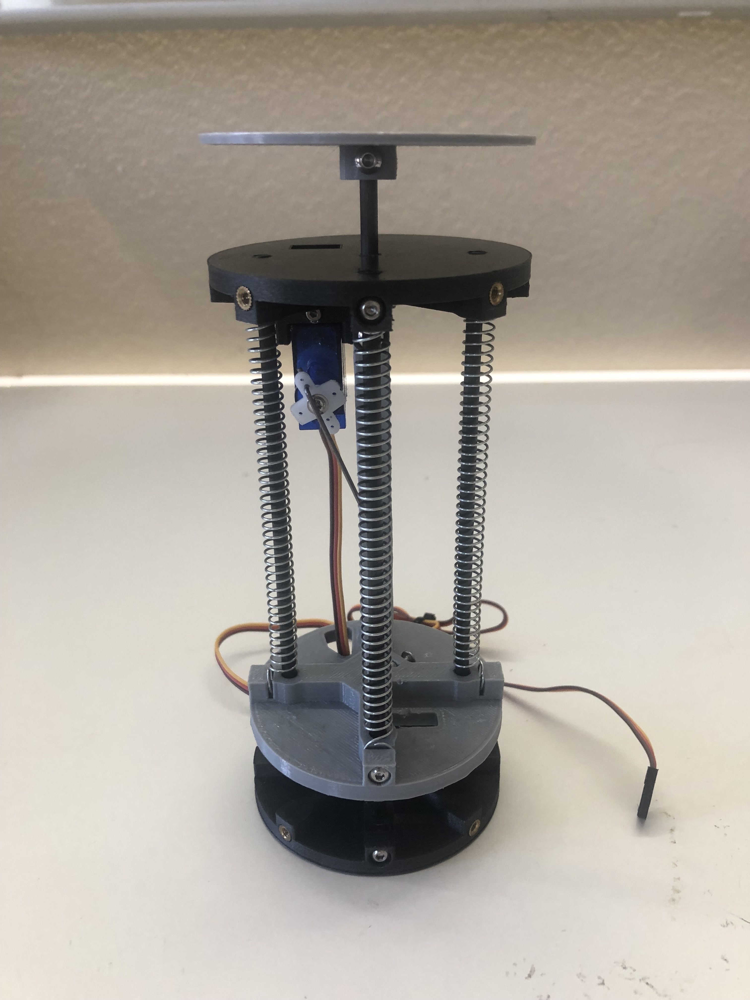
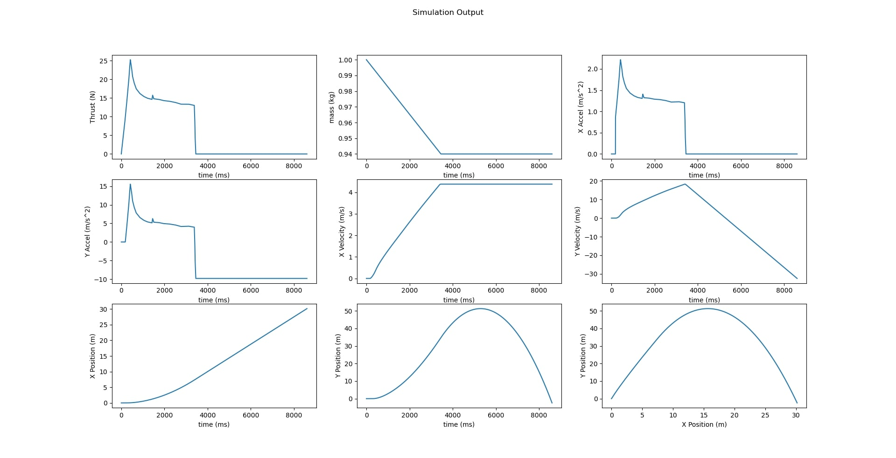

# Thrust Vector Controlled (TVC) Model Rocket
*May 2020 - Aug 2021*  

A thrust vector controlled rocket is a rocket that can adjust the direction of its propulsive elements to maintain stability and control its trajectory during flight. This technique is famously emplyoyed by SpaceX for their rockets.

This project was an ambitious undertaking, and while I didn’t complete it, it marked a significant turning point in my growth as a mechanical engineer. At the time, I was still in community college and lacked formal training in fluid dynamics, control theory, coding, and PCB design—all critical aspects of a project like this. Despite these challenges, diving into this complex field helped me build confidence and develop a range of new skills I had previously been hesitant to explore.

---

### Mechanical Build
I began the project by designing a thrust vector control (TVC) mount for a solid-fuel rocket motor. The mount, housed within a compact 74mm airframe, features two degrees of freedom with ±5 degrees of actuation controlled by high-torque servos. Designing within the tight constraints of the airframe required multiple iterations to optimize for both functionality and space efficiency.

  

To ensure a safe recovery system, I also developed a parachute ejection mechanism. This system used a spring to provide ejection force, triggered by a servo activated by the pressure sensor upon detecting the rocket’s descent.

  

---

### Electrical Build
I designed a custom PCB based on a Teensy microcontroller to handle onboard data acquisition and control. The PCB incorporated a voltage regulator, MOSFETs to trigger the rocket motor, and connections for various sensors. These included a BMP280 barometric pressure sensor and a BNO-055 inertial measurement unit (IMU). Additionally, the board provided outputs for three servos, status LEDs, and an SD card for datalogging.

  

The pressure sensor determined altitude and triggered the parachute ejection, while the IMU captured acceleration and orientation data to support trajectory control.

---

### Software and Simulation
While I did not complete the control algorithm, this project significantly boosted my confidence in working with sensors and interpreting datasheets. I successfully interfaced all sensors, controlled servos and MOSFET outputs, and logged data to an SD card.

To model the rocket’s motion, I developed a Python-based 2D simulation. Using the Estes F15 thrust curve and a specified flight angle, the simulation calculated the rocket’s position, velocity, and acceleration. Further details about the simulation are available in the [Github Repo](https://github.com/ZacCac/Model-Rocket-Flight-Simulation/tree/main).

**Output plots of the simulation**

  

---

## Skills Applied:
- Originally modeled in **Fusion 360** then later redesigned in **SolidWorks**
- PCB schematic designed in **Autodesk Eagle** and flight computer ran **C** and **Arduino**
- Simulations created in **Python**
- Used **FDM 3D printing** and **Soldering** for fabrication

---

## What I learned
- The TVC system, while functional, exhibited significant mechanical slop, compromising movement accuracy. Addressing this would require either improved hardware tolerances or a robust control algorithm.
- Tackling unfamiliar, complex projects is highly rewarding but requires balancing new challenges with existing skills to maintain progress and motivation.\
- This project reinforced my passion for designing and building tangible, real-world systems with practical applications.

---