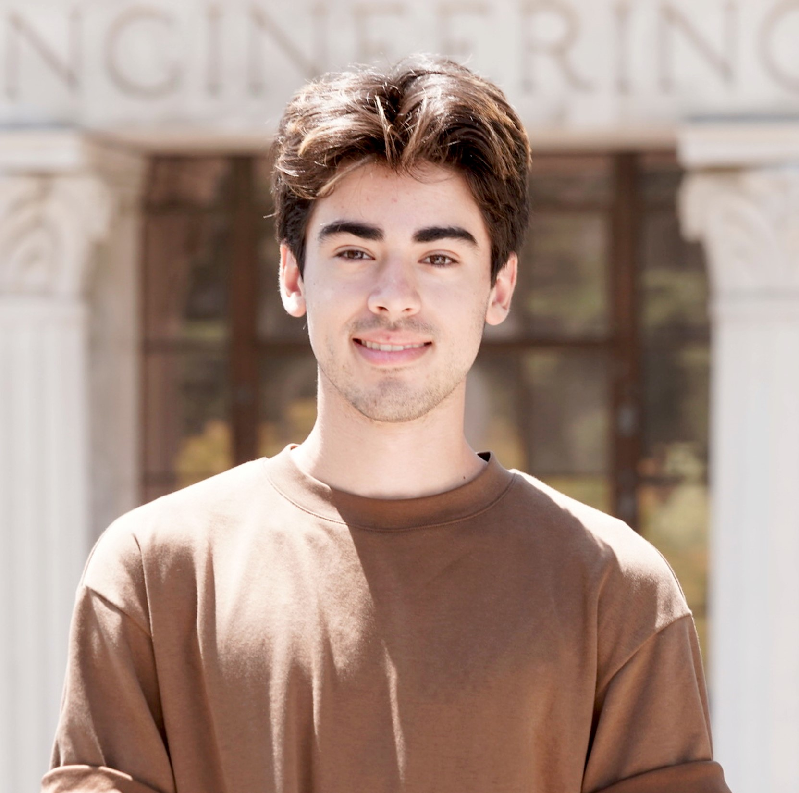
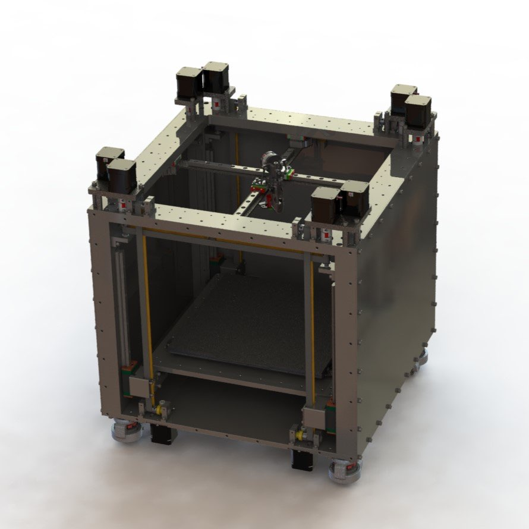
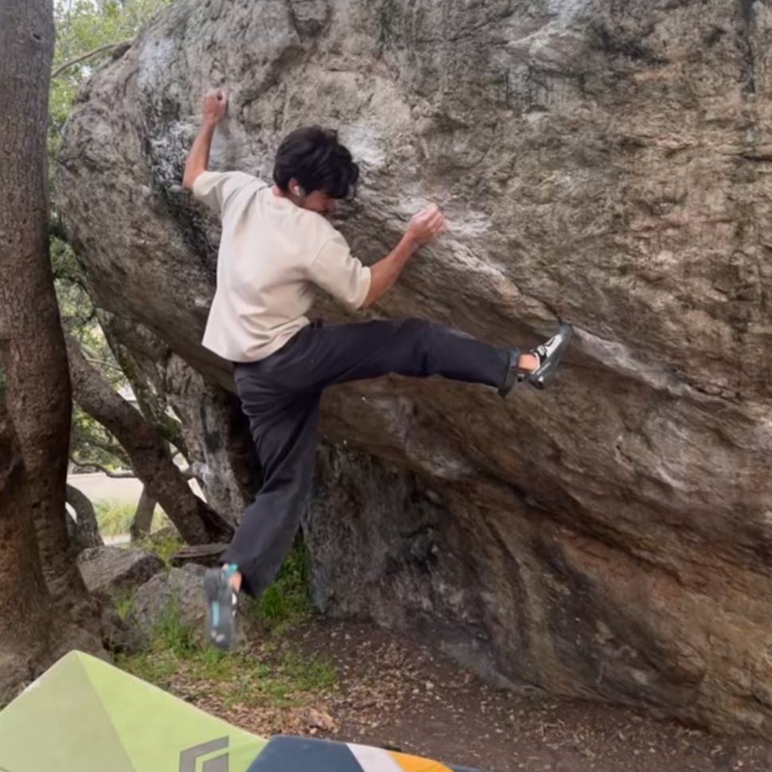

## About Me
Hello! My name is Zac Gwennap, and I’m a passionate **Mechanical Engineer** with a deep interest in additive manufacturing, mechanical design, and robotics.  

  

---

## Who I Am
I graduated from the **University of California, Berkeley** in December 2024 with a degree in **Mechanical Engineering** and a GPA of 3.65. My time as a student has been shaped by some amazing experiences, including working as an [intern at NASA Headquarters](https://www.nasa.gov/stem-content/x-59-3d-printing/) and two years as an undergraduate researcher at the [Additive Manufacturing and Metamaterials Lab (AMML)](https://www.raynexzheng.com/). I currently work at Fierro Fab, designing custom car parts as the Lead Mechanical Engineer.

Outside of work, I’m an avid rock climber, I love camping and backpacking, and I am an enthusiast for designing and building 3D printers.

  
  

---

## Quick Links
- [**GitHub**]({{site.aux_links.GitHub }}){: .btn .btn-primary }
- [**LinkedIn**]({{site.aux_links.LinkedIn }}){: .btn .btn-primary }
- [**Resume (PDF)**](/assets/Gwennap_Zac_Resume.pdf){: .btn .btn-primary }
